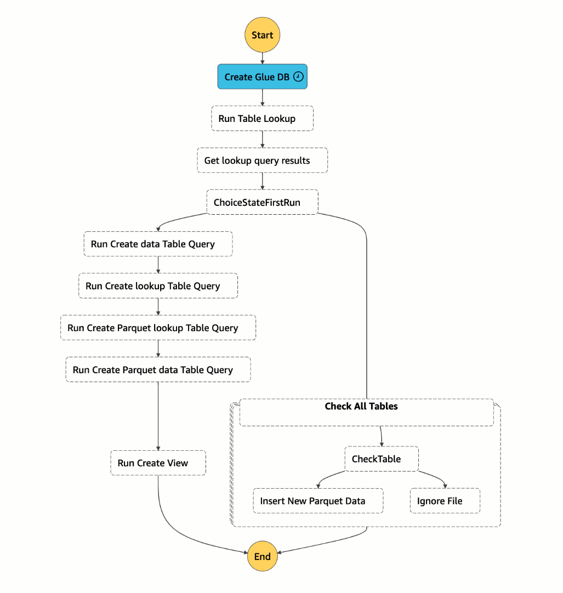

 

  <h1 align="center">AWS Academy Data Engineering</h1>
  

     
     Building & Orchestrating ETL Pipelines by Using Athena and Step Functions
  

  

    
  

### Project date
------------------
- 31 July 2023

### Tech Stack
------------------
- AWS Step Functions
- Amazon S3
- Amazon Athena
- AWS Glue

### Project Description
-----------------
In this lab, I used AWS Step Functions to build an extract, transform, and load (ETL) pipeline that uses Amazon Simple Storage Service (Amazon S3), an AWS Glue Data Catalog, and Amazon Athena to process a large dataset.

Step Functions can help you automate business processes by creating workflows, also referred to as state machines. In this lab, I used Step Functions to build a workflow that invokes Athena to take a series of actions. An example of an action is running a query to discover if AWS Glue tables exist.

The AWS Glue Data Catalog provides a persistent metadata store, including table definitions, schemas, and other control information. This information will help you to create the ETL pipeline.

Athena is a serverless interactive query service that simplifies analyzing data in Amazon S3 by using standard SQL.

I designed the workflow so that if AWS Glue tables don't exist, the workflow will invoke additional Athena queries to create them. If the tables do exist, the workflow will run an additional AWS Glue query to create a view in Athena that combines data from two tables. I then queried that view to make interesting time-based and location-based discoveries in the large dataset.

### Hands-On Lab
------------------

- [Lab](https://www.youtube.com/watch?v=wdHhvifXs14&t=1200s)

### Objectives
-----------------
- [X] Create and test a Step Functions workflow by using Step Functions Studio
- [X] Create an AWS Glue database and tables
- [X] Store data on Amazon S3 in Parquet format to use less storage space and to promote faster data reads
- [X] Partition data that is stored on Amazon S3 and use Snappy compression to optimize performance
- [X] Create an Athena view
- [X] Add an Athena view to a Step Functions workflow
- [X] Construct an ETL pipeline by using Step Functions, Amazon S3, Athena, and AWS Glue

