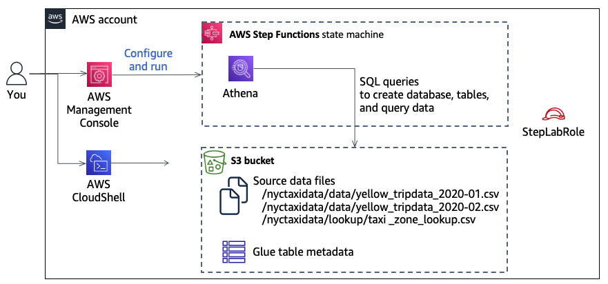
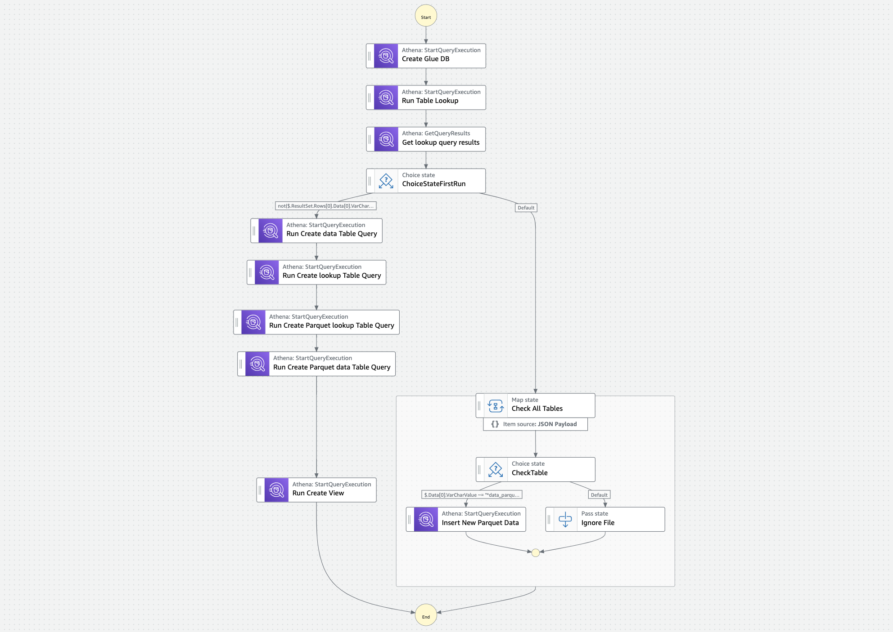

<h1 align="center">Building & Orchestrating ETL Pipelines by Using Athena and Step Functions</h1>

   
  AWS Academy Data Engineering

  

### Project date
------------------
- 31 July 2023

### Tech Stack
------------------
- AWS Step Functions
- Amazon S3
- Amazon Athena
- AWS Glue

### Hands-On Lab
------------------

- [View Here](https://youtu.be/kcuwa8EZ69Y)

### Project Description
-----------------

In this lab, I used AWS Step Functions to build an extract, transform, and load (ETL) pipeline that uses Amazon Simple Storage Service (Amazon S3), an AWS Glue Data Catalog, and Amazon Athena to process a large dataset.

Overview of the ETL pipeline:
Data was extracted from New York City taxi data, which is stored in Amazon S3. 

The data underwent transformations, including schema inference and column name adjustments using AWS Glue. If AWS Glue tables do not exist, additional Athena queries will be executed to create them. If the tables already exist, an AWS Glue query will be run to create a view in Athena that combines data from two tables.

The data was partitioned by pickup year and pickup month to enhance query performance. The transformed data was stored on Amazon S3 in Parquet format with Snappy compression, conserving storage space and enhancing data read speed. The data was then loaded into Athena, where it was queried using standard SQL for analysis.

Step Functions workflow:
The Step Functions workflow orchestrated the tasks, making it efficient and automated. The pipeline allows you to quickly start new data processing projects without having to repeat manual steps, making analysis of taxi usage patterns in New York City during the early part of 2020 easier and more efficient.

The Step Functions workflow was constructed by using Step Functions Studio: 

### Objectives
-----------------
- [X] Create and test a Step Functions workflow by using Step Functions Studio
- [X] Create an AWS Glue database and tables
- [X] Store data on Amazon S3 in Parquet format to use less storage space and to promote faster data reads
- [X] Partition data that is stored on Amazon S3 and use Snappy compression to optimize performance
- [X] Create an Athena view
- [X] Add an Athena view to a Step Functions workflow
- [X] Construct an ETL pipeline by using Step Functions, Amazon S3, Athena, and AWS Glue

